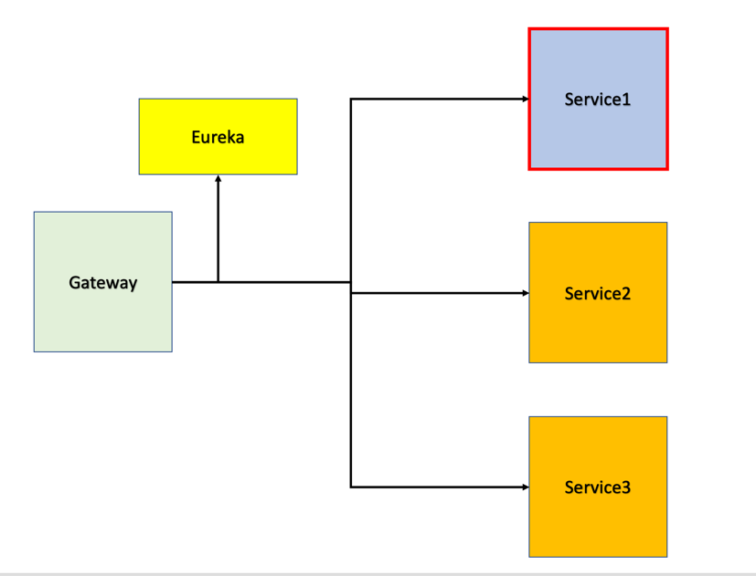

# service1

"resttemplate, openFeign 관련한 테스트를 시행하는 프로젝트입니다."
- https://themapisto.tistory.com/177

### Resttemplate API CALL

- ("/rest/test1")
    - url : postman  
  
- ("/rest/test2")
    - url : client.taskoo.net/services

### Jenkinsfile, Dockerfile 
- kubernetes 배포 로직 구축 예정